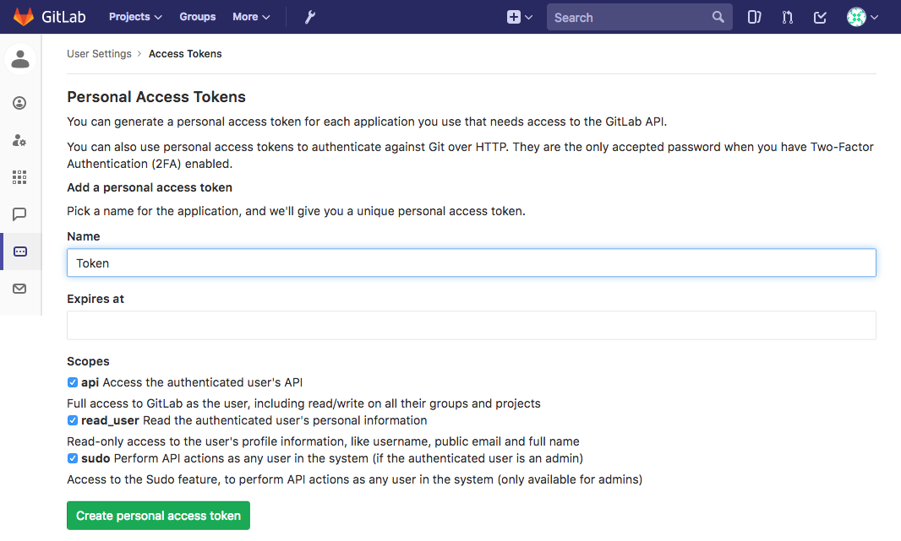
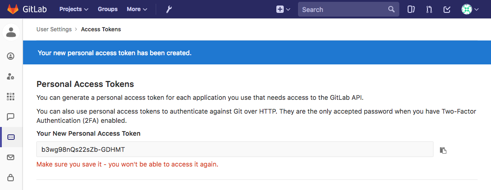
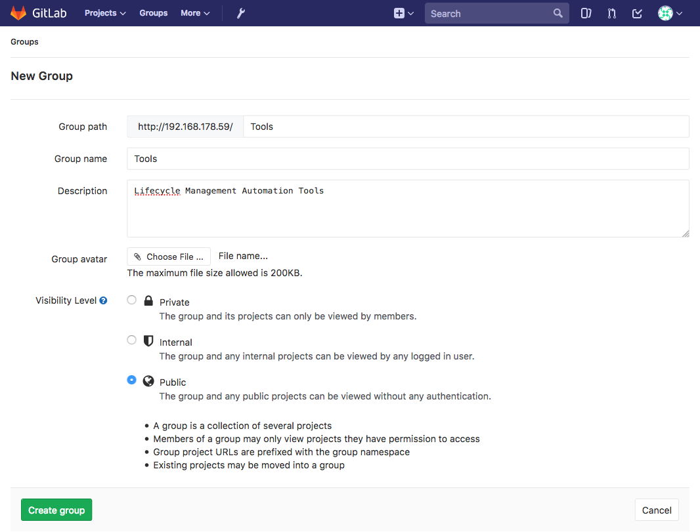
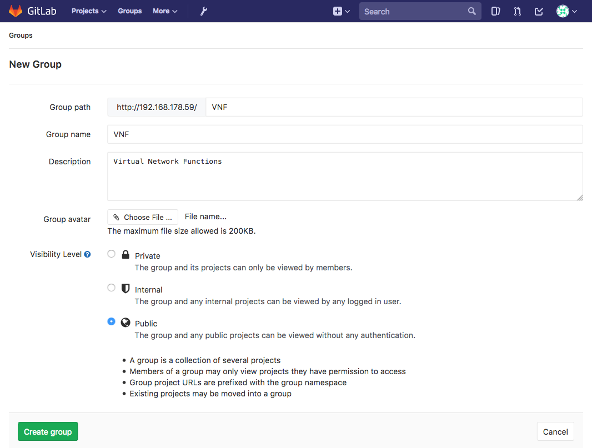
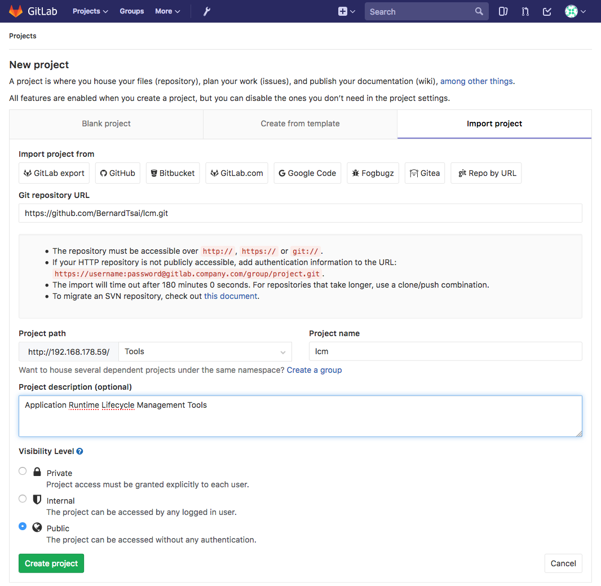
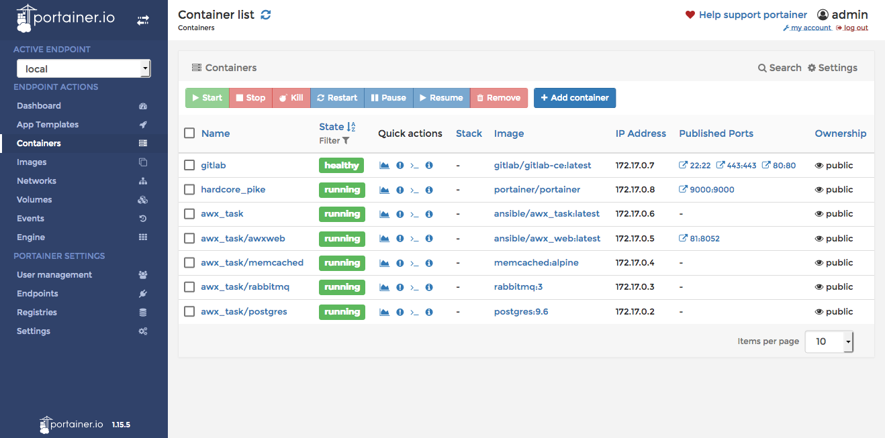

# Installation

This section provides guidelines of how to setup a simple application
orchestrator. As a result a server with a docker engine will host
four applications and their corresponding containers:

* [**Portainer**](https://github.com/portainer/portainer):  
  an open-soure management user interface for docker
* [**AWX**](https://github.com/ansible/awx):  
  an open-source automation solution developed by RedHat Inc.
  for provisioning software, managing configurations and deploying applications.
* [**GitLab**](https://gitlab.com/):  
  is a web-based Git repository manager with wiki and issue tracking features,
  using an open source license, developed by GitLab Inc.
* **Directory**:  
  is an open-source solution developed by Deutsche Telekom AG
  capable of generating configuration files for automated lifecycle management
  processes from a standardised application descriptor.

The setup is by no means to be regarded as a production ready solution
but merely provides an environment to test and verify model driven
lifecycle management concepts for applications.

## Prerequisites

The following prerequisites need to be met:

- [ ] a x86_64 or amd64 server with Ubuntu > 16.04
- [ ] > 8 GB RAM
- [ ] > 10 GB Disk
- [ ] internet access
- [ ] access to an OpenStack API for provisioning

## Configure Server

Initially a set software packages (git, python3, pip, ansible, docker) need to be installed and configured.

A) Update and configure the **apt** package manager to support https:

```
sudo apt-get update
sudo apt-get -y install \
     apt-transport-https \
     ca-certificates \
     curl \
     software-properties-common
```

B) Install the **git** version control system:
```
sudo apt-get -y install git
```

C) Install the **python3** language and **pip** package manager:

```
sudo apt-get -y install python3
sudo apt-get -y install python3-pip
```

D) Install the software deploymnent and coniguration management tool **ansible**:

```
sudo pip install ansible
```

E) Install the container management software **docker**:

```
sudo apt-get remove docker docker-engine docker.io
curl -fsSL https://download.docker.com/linux/ubuntu/gpg | sudo apt-key add -
sudo add-apt-repository \
   "deb [arch=amd64] https://download.docker.com/linux/ubuntu \
   $(lsb_release -cs) \
   stable"
sudo apt-get update
sudo apt-get -y install docker-ce
```

## Install and configure GitLab

The GitLab installation and configuration process will setup GitLab as
a docker container, adjust the admin credentials and setup the required
repository structure for the lifecycle management processes.

A) Install GitLab as a monolithic container:

```
sudo docker run --detach \
    --hostname gitlab.example.com \
    --publish 443:443 --publish 80:80 --publish 22:22 \
    --name gitlab \
    --restart always \
    --volume /srv/gitlab/config:/etc/gitlab \
    --volume /srv/gitlab/logs:/var/log/gitlab \
    --volume /srv/gitlab/data:/var/opt/gitlab \
    gitlab/gitlab-ce:latest
```

B) Define the password for the "root":  

The very first time you visit GitLab by opening the URL "http://localhost" in a browser, you will be asked to set up the admin password. After you change it, you can login with username root and the password you set up

C) Create a personal access token:

From the main page select profile **settings** and then
select the **Access Tokens** from User Settings. Define a token with the name "Token" as shown in the picture below:



GitLab will create a new access token which needs to be saved for further configuration purposes:



The token will allow to automate the storing data to and retrieving data from the repository via the GitaLab API.

D) Create **Tools** and **VNF** group:

Select **groups** from the home page and then select **New group** to create the public **Tools** group which will hold all the automation tools for the lifecycle management of virtual network functions.



In the same manner create the public **VNF** group which will hold the projects related to virtual network functions.



E) Import the Lifecycle Management Project:

Select **groups** / **Lifecycle Management Automation Tools** group and then select **New project** and **Import project** in order to create a new public project called **lcm**:



This project will host the repository for the lifecycle management scripts imported by the AWX automation tool.

For further details refer to the GitLab docker [installation guide](https://docs.gitlab.com/omnibus/docker/README.html).

## Install and configure AWX

Clone the AWX repo:
```
git clone https://github.com/ansible/awx.git
```

This will create the subdirectory **awx** which will contain the contents of
the AWX repository

Adjust the port to which AWX listens to 81 to prevent collisions with the GitLab user interface by configuring the inventory file.  

```
cd awx/installer
sed -i 's/host_port=80/host_port=81/' inventory
```

Now invoke the ansible playbook to install AWX:

```
sudo ansible-playbook -i inventory install.yml
```

As soon as the installation process has completed it will be possible to access the AWX user interface by opening the url "http://localhost:81" in a browser.

The default credentials being: **admin/password**

A simple python setup script: "configure_awx.py" will create:

* an **organisation** named "DTAG"
* a **project** named "lcm" project which downloads the lifecycle management tools from the GitLab Tools/lcm repository
* an **inventory** for the ansible lifecycle management playbooks
* a set of **job templates** for deploying, scaling-in, scaling-out and cleaning a virtual network function as well as a job template for obtaining an inventory for an existing virtual network function.

Of course it is also possible to create the required entities with the help of
the user interface directly.

For further details please refer to the AWX [install guide](https://github.com/ansible/awx/blob/devel/INSTALL.md)

## Install and configure Directory

TODO

## Install and configure portainer

Install the docker management UI **portainer**:

```
sudo docker run -d -v "/var/run/docker.sock:/var/run/docker.sock" -p 9000:9000 portainer/portainer
```

When opening "http://localhost:9000" the portainer user interface should appear asking for the password for the admin account.

After that allow portainer to connect to the local server to gain access
to the local docker engine.

The final result of the installation process can be seen in the portainer user interface:


