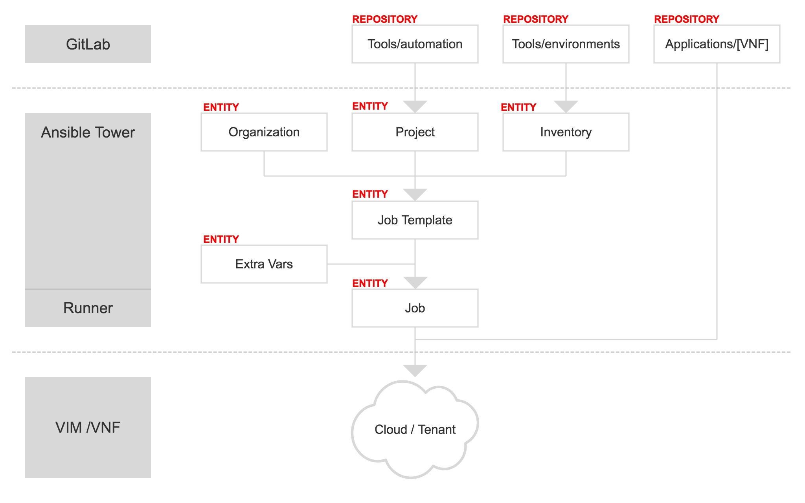

# Application Orchestrator

The application orchestrator manages the lifecycle of applications by making use of a formal description of their architecture.
This information is transformed to a set of parameters which are fed to ansible playbooks automating the lifecycle of the applications in a standardised way.

The following diagram is an overview of the information model of the application orchtestrator.

The GitLab component of the application orchestrator holds three repositories in two groups:

* **Tools group**
  * **automation repository**  
    holds ansible playbooks, scripts and templates
  * **environments repository**  
    holds inventory files for the ansible playbboks
* **Applications group**
  * **VNF repository**  
    holds the application descriptor, playbook parameter files and inventory information

Ansible Tower (AWX) organises the execution of the playbooks by first defining their **organisational context**. The repository with the ansible playbooks is imported from GitLab into an **Ansible Tower project**. In the same manner the inventory information is copied from the GitLab repository to an **Ansible Tower inventory**.

A **job template** makes use of these entities and defines for playbooks:
* the access rights,
* which inventory information to use and
* which **extra variables** should be applied.

A job template is created for each lifecycle management use-case.

The **jobs** are instantiations of job templates and make use application specific parameters residing in the application repository.
These are executed either on runner environments or a model transformation again.
