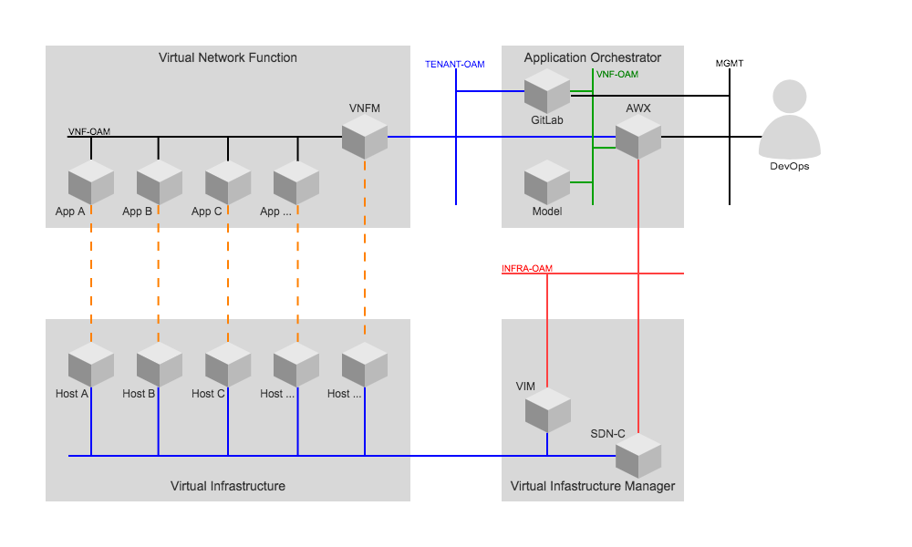

# Architecture

The application orchestrator architecture includes several components in order
to manage the runtime lifecycle of applications:

These components are depicted in the upper right corner of the diagram and include:

* **Ansible Tower**  
Ansible Tower AWX provides a web-based user interface, REST API, and task engine built on top of Ansible. It is the upstream project for Tower, a commercial derivative of AWX and developed by
[Red Hat Inc](https://www.redhat.com).
* **GitLab**  
a web-based Git repository manager with wiki and
issue tracking features, using an open source license, developed by [GitLab Inc](https://about.gitlab.com/).  
This component maintains the VNF descriptors, environment specific configuration parameters and customization scripts.
* **Model**  
a model transformation engine capable of converting an abstract VNF descriptor into a set of files which parameterise the execution of ansible playbooks for managing the lifecycle of applications.
This transformation takes into account the platform specific capabilities, constraint and requirements to be met.

A DevOps can upload the artefacts required for the lifecycle management of VNF to GitLab. In addition he can trigger and monitor the execution of lifecycle management procedures via Ansible Tower (AWX).

The Application Orchestrator itself has access to the API endpoints of the Virtual Infrastructure Manager (VIM) and SDN-Controller (SDN-C).

It also interacts with the VNF specific Manager (VNF-M) to support the provisioning of required artefacts and triggering of policies to
adjust the virtual resources according to the demand of the VNF.

The reference implementation of the Application Orchestrator is implemented as a docker engine with a set of containers for the components listed above.
