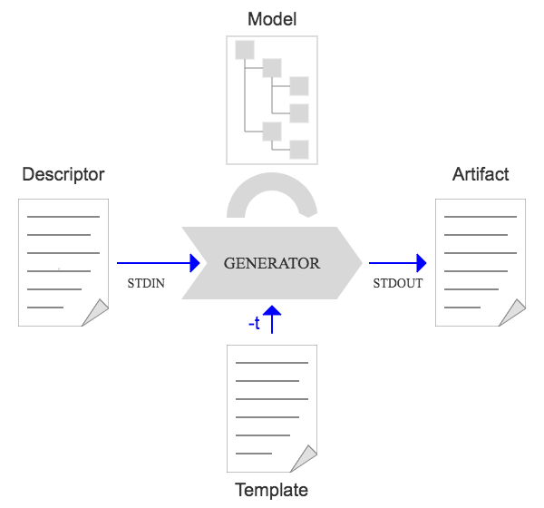

# Model Engine

The model engine transforms a VNF/application descriptor into an internal model,
which reflects the specific characteristics of a cloud environment.
This internal model can then be feed into a set of templates which are required for the automation procedures,
e.g. parameter files for scripts, security policies, etc. .   

It is a simple python program which basically processes the information in the following way:

* read the yaml descriptor from STDIN
* convert the yaml descriptor into a python object
* parse the python object and construct the internal model (which is a python object as well)
* pass the internal model to a jinja2 template
* output the result via STDOUT
