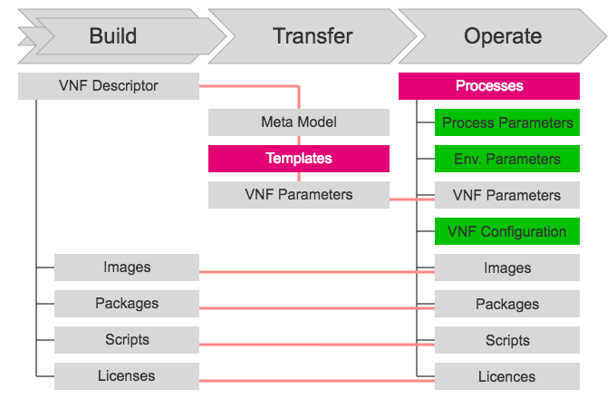

# Build / Transfer / Operate

The build/transfer/operate process structures the way applications from different suppliers
can be handed over to an operator in a standardised way.

Following a model driven automation approach the process is conducted in the following manner:

* The supplier hands over a simplified VNF/application descriptor and a set of corresponding artefacts (images, packagaes, scripts, licenses, ...) to the operator.
* The descriptor is then expanded and mapped to a meta model which holds all information and relationships required for the lifecycle management procedures.
* The information in the meta model is filled into templates thereby creating VNF/application parameter files for the lifecycle management procedures.  
* The lifecycle management processes can then be initiated in the context (e.g. relevant VNF, component, ...) defined by process instance parameters. In the course of the execution environment specific parameters are used to access API endpoints. The lifecycle management processes will typically evaluate the current VNF/application configuration and from this information derive how to apply the desired changes.

Entities:
---------

* **VNF Descriptor**  
  A VNF or application descriptor is a deployment template which describes it in terms of its deployment and operational
  behaviour requirements.
* **Image**  
  A collection of files for a specific operating system (OS) that you use to create or rebuild a server. OpenStack provides pre-built images. You can also create custom images, or snapshots, from servers that you have launched. Custom images can be used for data backups or as “gold” images for additional servers.
* **Package**  
  Individual files or resources are packed together as a software collection that provides certain functionality as part of a larger system
* **Scripts**  
  Scripts are pieces of software to configure an application component.
* **Licenses**  
  A software license is a legal instrument (usually by way of contract law, with or without printed material) governing the use or redistribution of software. A typical software license grants the licensee permission to use one or more copies of software in ways where such a use would otherwise potentially constitute copyright infringement of the software owner's exclusive rights under copyright law.
* **Meta Model**  
  The meta model is a simplified or approximated descriptive model of another descriptive model.
* **Templates**  
  The template
* **VNF Parameters**  
  A set of parameters describing the desired target state of a VNF/application.
* **Processes**  
  A set of standardised application lifecycle management procedures including:
  * onboarding of a version of a VNF/application
  * deployment of a version of a VNF/application
  * scaling-out of a VNF/application component
  * scaling-in of a node of a VNF/application component
  * healing of a node of a VNF/application component
  * upgrading of a VNF/application component
  * migration of a node of VNF/application component
  * status of a VNF/application
* **Process Parameters**  
  Context information passed to the lifecycle management procedures.
* **Environment Parameters**  
  API Endpoints and access credentials.
* **VNF Configuration**  
  A set of parameters describing the current state of a VNF/application.
