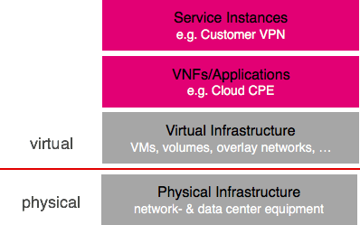

# Application Architecture

The generic structure of a VNF application is depicted in the following diagram:



```
placeholder for the diagram with the interconnected multi-dc VNF setup
```

It details the structure of the solution in the context of the virtual
infrastructure and application layer.

A VNF may reside in one or more tenants which may be regarded as virtual data
centres. In each of these data centres there may be one or more functional
clusters consisting of one or more cluster nodes.

Each of these cluster nodes is represented by a virtual host which is provided
by the virtual infrastructure. These nodes make use of an operating system into
which the application is deployed and configured. In addition content
information may be held in such a cluster node.

These cluster nodes may either be provided as prepackaged appliances or as
software applications which need to be installed on top of an operating system.

To simplify runtime lifecycle management the entities:

* the VNF/Application,
* the tenants,
* the networks,
* the clusters,
* the cluster nodes and
* the cluster volumes

are all regarded to be components which share a common set of attributes
and follow a common lifecycle model as described in the following chapters.
